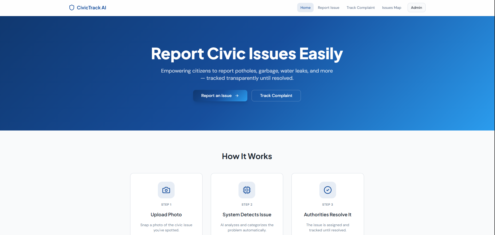
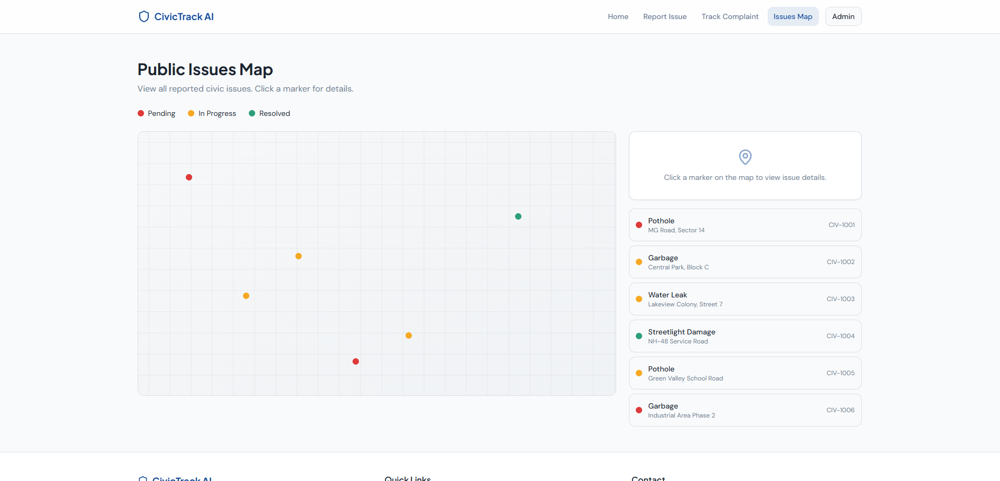
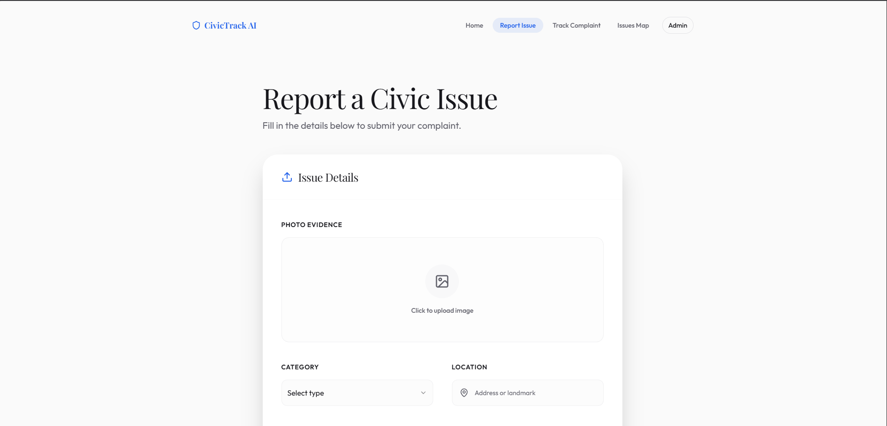
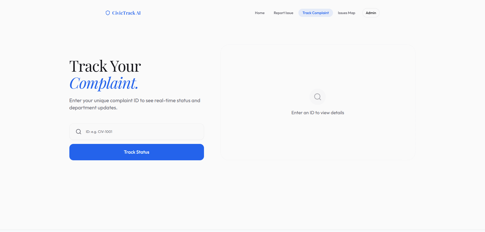

# CivicTrack AI

[](./LICENCE)


> **Empowering citizens to report, track, and resolve civic issues — transparently.**

CivicTrack AI is a modern civic engagement platform that bridges the gap between citizens and local authorities. Citizens can report infrastructure issues with photos, track their complaints in real time, and view all reported issues on a public map — all powered by an AI-assisted categorization pipeline.

---

## System Preview

| Admin Dashboard | Public Issues Map |
| :---: | :---: |
|  |  |

| Report an Issue | Track Complaint |
| :---: | :---: |
|  |  |

---

## Features

| Feature | Description |
|---|---|
| **Report Issues** | Submit civic complaints (potholes, garbage, water leaks, streetlight damage) with photo upload and location |
| **Track Complaints** | Look up any complaint by its unique ID and see its current resolution status |
| **Public Issues Map** | Visualize all reported issues on an interactive map with color-coded status markers |
| **AI Categorization** | Uploaded photos are analyzed and auto-categorized by issue type |
| **Admin Dashboard** | Municipal staff can view all complaints, update statuses, and manage notifications |
| **Live Statistics** | Platform-wide stats (Total Reported, Resolved, In Progress, Pending) updated in real time |

---

## Pages & Routes

| Route | Page | Description |
|---|---|---|
| `/` | **Home** | Landing page with hero section, how-it-works steps, and platform statistics |
| `/report` | **Report Issue** | Form to submit a new civic complaint with photo, type, description, and location |
| `/track` | **Track Complaint** | Search by complaint ID (e.g. `CIV-1001`) to view its status and details |
| `/map` | **Issues Map** | Public map showing all complaints as interactive, color-coded markers |
| `/admin` | **Admin Dashboard** | Protected panel for updating complaint statuses and viewing notifications |

---

## Tech Stack

| Layer | Technology |
|---|---|
| **Framework** | [React 18](https://react.dev/) + [Vite](https://vitejs.dev/) |
| **Language** | [TypeScript](https://www.typescriptlang.org/) |
| **Routing** | [React Router v6](https://reactrouter.com/) |
| **UI Components** | [shadcn/ui](https://ui.shadcn.com/) + [Radix UI](https://www.radix-ui.com/) |
| **Styling** | [Tailwind CSS v3](https://tailwindcss.com/) |
| **Data Fetching** | [TanStack Query v5](https://tanstack.com/query) |
| **Forms** | [React Hook Form](https://react-hook-form.com/) + [Zod](https://zod.dev/) |
| **Charts** | [Recharts](https://recharts.org/) |
| **Icons** | [Lucide React](https://lucide.dev/) |
| **Theming** | [next-themes](https://github.com/pacocoursey/next-themes) |
| **Testing** | [Vitest](https://vitest.dev/) + [Testing Library](https://testing-library.com/) |

---

## Getting Started

### Prerequisites

- [Node.js](https://nodejs.org/) v18 or higher
- [npm](https://www.npmjs.com/) (or [Bun](https://bun.sh/) for faster installs)

### Installation

```bash
# 1. Clone the repository
git clone https://github.com/Ashvinigowda/civictrack-ai.git

# 2. Navigate into the project directory
cd civictrack-ai

# 3. Install dependencies
npm install

# 4. Start the development server
npm run dev
```

The app will be available at **http://localhost:5173**

---

## Available Scripts

| Command | Description |
|---|---|
| `npm run dev` | Start the development server with hot-reload |
| `npm run build` | Build the production bundle |
| `npm run build:dev` | Build in development mode |
| `npm run preview` | Preview the production build locally |
| `npm run lint` | Lint the codebase with ESLint |
| `npm run test` | Run unit tests with Vitest (single run) |
| `npm run test:watch` | Run tests in watch mode |

---

## Project Structure

```
civictrack-ai/
├── public/                  # Static assets
├── src/
│   ├── components/          # Shared UI components
│   │   ├── ui/              # shadcn/ui primitives
│   │   ├── Navbar.tsx       # Top navigation bar
│   │   ├── Footer.tsx       # Site footer
│   │   ├── Layout.tsx       # Page layout wrapper
│   │   └── NavLink.tsx      # Active-aware navigation link
│   ├── data/
│   │   └── mockData.ts      # Mock issues, notifications & types
│   ├── hooks/               # Custom React hooks
│   ├── lib/                 # Utility functions (e.g., cn helper)
│   ├── pages/
│   │   ├── Index.tsx        # Home / landing page
│   │   ├── ReportIssue.tsx  # Complaint submission form
│   │   ├── TrackComplaint.tsx # Complaint status lookup
│   │   ├── IssuesMap.tsx    # Public issues map
│   │   ├── AdminDashboard.tsx # Admin management panel
│   │   └── NotFound.tsx     # 404 page
│   ├── App.tsx              # Root component & route definitions
│   ├── main.tsx             # React DOM entry point
│   └── index.css            # Global styles & design tokens
├── components.json          # shadcn/ui configuration
├── tailwind.config.ts       # Tailwind CSS configuration
├── vite.config.ts           # Vite bundler configuration
├── vitest.config.ts         # Vitest test configuration
└── tsconfig.json            # TypeScript configuration
```

---

## System Architecture


> **Note**: An editable version of this architecture diagram is available at [`public/raw-editiable-system-architecture.excalidraw`](public/raw-editiable-system-architecture.excalidraw). You can open it in [Excalidraw](https://excalidraw.com/) to edit.

---

## How It Works

```
Citizen                  CivicTrack AI               Authority
   │                           │                          │
   │  Upload photo + details   │                          │
   │──────────────────────────>│                          │
   │                           │  AI categorizes issue    │
   │                           │─────────────────────>    │
   │  Complaint ID returned    │                          │
   │<──────────────────────────│  Assigns to department   │
   │                           │─────────────────────────>│
   │  Track status via ID      │                          │
   │──────────────────────────>│  Updates status          │
   │                           │<─────────────────────────│
   │  View resolved status     │                          │
   │<──────────────────────────│                          │
```

1. **Report** — A citizen spots an issue and submits it with a photo, type, and location.
2. **Detect** — The AI pipeline analyzes the image and auto-categorizes the problem.
3. **Assign** — The issue is routed to the relevant municipal department via the admin dashboard.
4. **Track** — The citizen can check the complaint's status at any time using their unique ID.
5. **Resolve** — Once fixed, the authority marks it as resolved and the map updates in real time.

---

## Design System

CivicTrack AI uses a custom Tailwind design system built around civic clarity and accessibility:

- **Color Palette**: Primary civic blue, accent green (resolved), amber (in-progress), destructive red (pending)
- **Typography**: `font-heading` for display text, system font stack for body
- **Components**: Consistent `civic-card`, `civic-badge-*`, and `stat-card` utility classes
- **Animations**: Subtle `animate-fade-in` and `animate-count-up` for a polished feel

---

## Testing

```bash
# Run all tests once
npm run test

# Run tests in interactive watch mode
npm run test:watch
```

Tests are located in `src/test/` and use [Vitest](https://vitest.dev/) with [React Testing Library](https://testing-library.com/docs/react-testing-library/intro/).


## Contributing

Contributions, bug reports, and feature requests are welcome!

1. Fork the repository
2. Create a new branch: `git checkout -b feature/your-feature-name`
3. Commit your changes: `git commit -m "feat: add your feature"`
4. Push to your branch: `git push origin feature/your-feature-name`
5. Open a Pull Request

## License

This project is licensed under the **[MIT License](./LICENCE)** — see the [`LICENCE`](./LICENCE) file for full details.


<div align="center">
  <sub>Built with ❤️ to make cities better, one report at a time.</sub>
</div>

---
